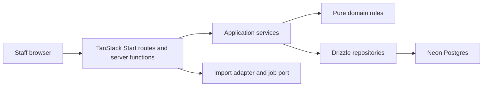

# Architecture overview

## Dependency boundaries

`src/domain` is deterministic TypeScript and has no framework/database imports.
`src/application` coordinates domain rules and depends on interfaces in
`src/application/ports`. `src/db` implements those interfaces. `src/server`
adapts requests to authorized application services. `src/features` contains
the UI and communicates through typed server functions only.

## Deployment

Vercel hosts the TanStack Start/Nitro application. Neon supplies Postgres.
The initial synchronous import/grouping adapters are isolated behind job ports
so a durable worker can be introduced without changing domain contracts.
